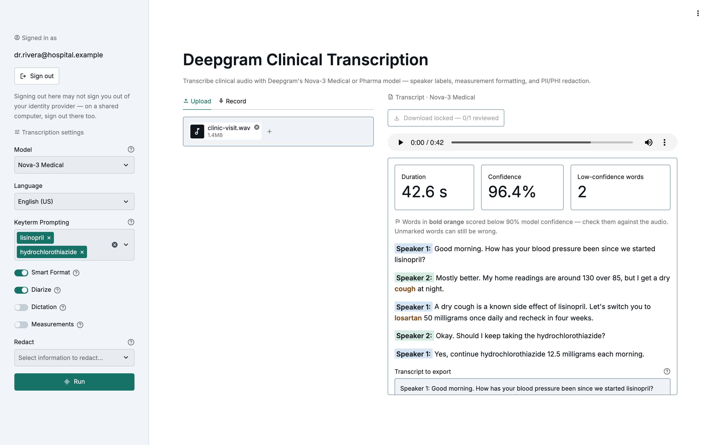

# Deepgram Medical Transcription

[](https://github.com/darylalim/deepgram-medical-transcription/actions/workflows/ci.yml) [](LICENSE)

Streamlit application for medical transcription using Deepgram's Nova-3 Medical model (English-only), built on a framework-free core (`nova/`) that handles option building, batching, and response parsing.

> **Reference implementation — not certified for clinical use.** You are responsible for your own Deepgram BAA and PHI handling before any real patient data flows through this app. See [License](#license).

<picture>
  <source media="(prefers-color-scheme: dark)" srcset="docs/screenshot-dark.png">
  
</picture>

<sub>Screenshot uses a synthetic, fictional transcript — no real patient audio.</sub>

## Features

- **Sign-in** — OpenID Connect through Streamlit's `st.login` (Google Workspace, Microsoft Entra ID, Okta, …), limited to allowlisted email domains and verified emails, with a 12-hour session limit. The gate fails closed: a missing or broken configuration blocks the app instead of opening it. See [Access control](#access-control).
- **Batch transcription** from two input sources — upload files or record from the microphone.
- **Nova-3 Medical** speech-to-text across eight English variants.
- **Keyterm prompting** — boost recognition of specialized vocabulary (drug names, procedures).
- **Speaker diarization** with color-coded per-speaker transcript lines.
- **Low-confidence flags** — words Deepgram scored below 90% confidence are shown in **bold orange**, with a per-result count, so review starts where the model was least sure.
- **Review and sign-off** — each result gets an editor holding the text to export; correct it against the audio, then mark it **Reviewed against the audio**, which freezes it.
- **Redaction** — PII for de-identification, plus PHI, PCI, and number groups (PHI and Numbers also strip clinical content).
- **Smart formatting**, spoken **dictation** commands, and **measurement** abbreviation.
- **Download** — the reviewed (and edited) transcripts as plain text (`.txt`), with a multi-file batch combined into one file. Locked until every result in the batch is marked reviewed.
- **"Reading room" light & dark themes** — a clinical blue-slate palette with a teal accent that follows your OS light/dark setting (switchable in Settings), WCAG AA throughout in both modes, with self-hosted fonts (no third-party CDN).

## Prerequisites

- [uv](https://docs.astral.sh/uv/) — manages the Python toolchain and dependencies (install: `curl -LsSf https://astral.sh/uv/install.sh | sh`).
- Python 3.12+ — `uv sync` fetches a compatible interpreter if you don't already have one.
- A Deepgram API key — create a free one at the [Deepgram Console](https://console.deepgram.com).

## Setup

1. Install dependencies: `uv sync` (this includes Authlib, through the `streamlit[auth]` extra).
2. Create your env file: `cp .env.example .env`, then set `DEEPGRAM_API_KEY`.
3. Configure sign-in: `cp .streamlit/secrets.toml.example .streamlit/secrets.toml`, then fill in your identity provider's client, a random `cookie_secret`, and your `allowed_email_domains`. See [Access control](#access-control). Until sign-in is configured, the app shows only "Sign-in is unavailable".

**Local development without sign-in:** set the opt-out in the environment of the one command.

```bash
NOVA_ALLOW_ANONYMOUS=1 uv run streamlit run streamlit_app.py
```

The app honors it only for the exact value `1`, only when no `[auth]` is configured, and only from the process environment. Put in `.env` or `secrets.toml`, it blocks the app instead. An **Anonymous mode** banner stays on screen. Never use it with real patient audio.

## Usage

```bash
uv run streamlit run streamlit_app.py
```

The app first asks you to **sign in** (unless you launched it in anonymous mode). Once you're signed in, the sidebar shows **Signed in as …** with a **Sign out** button. If `DEEPGRAM_API_KEY` is not set, the app then prompts for it inline.

**Select audio** from the input tabs on the left:

- **Upload** — up to 100 audio files (mp3, m4a, wav, flac, ogg; max 200 MB each)
- **Record** — record from microphone (max 30 minutes)

A **Features** panel in the left sidebar holds the request options, closed by a **Run** button. If you populate both input tabs, Run transcribes a single one by priority — **Upload, then Record** — and shows a notice naming which ran and which was ignored.

- **Language** — English variants (Nova-3 Medical is English-only)
- **Keyterm Prompting** — type specialized vocabulary (drug names, procedures, names), Enter to add each, up to 100, to boost recognition
- **Smart Format** (on by default) — punctuation, paragraph breaks, and entity formatting
- **Diarize** (off by default) — labels speaker turns as Speaker 1, Speaker 2, … in the transcript (speakers are numbered, not named by role); use it for clinician–patient encounters
- **Dictation** (off by default) — turns spoken commands like "period" / "new paragraph" into punctuation (also enables punctuation); for a single clinician dictating, not encounters. Run warns when Dictation and Diarize are both on
- **Measurements** (off by default) — abbreviates spoken units (e.g. "five milligrams" → "5 mg"). Volumes come out as lowercase "ml" / "l", which [ISMP](https://www.ismp.org/recommendations/error-prone-abbreviations-list) lists as error-prone (use mL / L), so review volumes before clinical use
- **Redact** (none by default) — replaces selected information with redaction tags. Four groups are selectable: **PII** de-identifies (names, locations, IDs); **PHI** removes clinical content itself (conditions, drugs, injuries); **PCI** redacts card numbers; **Numbers** redacts any run of three or more digits plus Deepgram's number-like entities (e.g. dates, times, ages, phone and account numbers, medical statistics, locations) — so clinical values are redacted unpredictably ("500 mg" always, shorter doses, vitals, and lab values only sometimes).

Once a request runs:

- **Live progress** — a status panel tracks the batch, with a toast when it finishes.
- **Transcript** — a single view under a **Transcript** header beside the inputs (stacked below them on narrow screens), displaying the response; multiple results are labeled and divided per file.
- **Metrics & download** — each transcript is topped with **Duration**, **Confidence**, and **Low-confidence words** metric cards. A download button above the panel saves every result in the batch as one `.txt` file — the text from each result's editor, not Deepgram's original — and stays locked (**Download locked — 1/2 reviewed**) until every result is marked reviewed. See [Reviewing a transcript](#reviewing-a-transcript).
- **Low-confidence flags** — words scored below 90% model confidence render in **bold orange**, under a caption that says whether any were flagged. If the per-word data is missing, or does not reproduce the transcript exactly, the transcript is shown unhighlighted with a notice to review every word. See [What a flag means](#what-a-flag-means).
- **Audio player** — pinned above the scrollable transcript. Inline audio over 25 MB — a large upload or a long recording — shows a notice instead of the player to limit memory.
- **Diarized view** — with **Diarize** on, the transcript is split into color-coded `Speaker 1:`, `Speaker 2:`, … lines.
- **Review controls** — under each highlighted transcript, a **Transcript to export** editor and a **Reviewed against the audio** checkbox (numbered "(1 of 2)", … in a multi-file batch).

### Reviewing a transcript

The highlighted view always shows Deepgram's original words; the **Transcript to export** editor below it is what **Download** saves. It starts as the same text, as plain `Speaker N:` lines when diarized, with no highlighting.

1. Play the audio and check the transcript against it, flagged words first.
2. Correct errors in the editor. An edit applies when you **click away or press Ctrl/⌘+Enter**, and an applied edit always leaves the result unreviewed — so if you type and then click **Reviewed** in one motion, confirm the box stayed checked.
3. Check **Reviewed against the audio**. This freezes that result's editor, so nothing typed afterwards can slip into the download. To change it, uncheck **Reviewed** (which re-locks **Download**), edit, and check it again.
4. Once every result is reviewed, **Download transcript** unlocks. A new **Run** starts over: fresh editors, nothing reviewed.

A long transcript appears twice in the scrolling panel — the highlighted view, then the editor.

### What a flag means

A flag is a pointer to the audio, not a verdict — check flagged words first, but review the whole transcript:

- **Threshold** — a word is flagged when Deepgram's per-word confidence is **below 90%** (`LOW_CONFIDENCE_THRESHOLD` in `nova/config.py`). Deepgram describes that score as a calibrated probability; 90% is a starting point to re-evaluate on your own de-identified audio. It is fixed server-side, not a per-user setting.
- **Unmarked words can still be wrong.** A model can be confidently wrong, and **keyterm prompting inflates confidence** for the boosted terms — a misheard drug name you listed as a keyterm may come back unflagged.
- **Redaction tags are never flagged** (`[SSN_1]`, `[REDACTED]`, …): the spoken content is gone, so there is nothing to check it against.
- **A flagged formatted number means "check the whole value."** Smart Format merges a spoken number into one token (a dose, a phone number) with one confidence, so the flag covers all of it.
- The flags describe Deepgram's original words and never move when you edit. The downloaded `.txt` carries the editor's text, which starts as those same words without highlighting.

**Troubleshooting** — if transcription fails with a per-file error (rather than the app refusing to start), check that `DEEPGRAM_API_KEY` is valid and has available credit: an invalid or expired key is reported as a per-item transcription failure, not a startup error.

## Access control

Every visitor passes a sign-in gate before the app renders anything else: no inputs, no API-key prompt, no results. Sign-in is OpenID Connect through Streamlit's built-in `st.login`, configured in `.streamlit/secrets.toml` (template: `.streamlit/secrets.toml.example`). The policy lives in `nova/access.py` and **fails closed**. A missing, partial, or unreadable configuration blocks the app rather than falling back to anonymous access.

| Situation | What the visitor sees |
|---|---|
| Sign-in configured, not signed in | A **Sign in** button (**Sign in with *Name*** for each extra provider) |
| Signed in and allowed | The app, with **Signed in as …** and **Sign out** at the top of the sidebar |
| Signed in but not allowed (domain, unverified email, no email) | Why, and **Sign out** |
| Signed in more than 12 hours ago, or through a provider since removed | "Your sign-in has expired", and **Sign in** |
| Not configured, or misconfigured | "Sign-in is unavailable. Contact your administrator." only. The reason, naming configuration keys but never values, goes to the server's stderr once per session |
| No `[auth]`, and `NOVA_ALLOW_ANONYMOUS=1` in the process environment | The app, under an **Anonymous mode** banner (local development only) |

**Who is allowed** is set in `[access]`:

- `allowed_email_domains` lists exact domains, matched case-insensitively. There are no wildcards and no subdomain matching: `sub.hospital.org` must be listed itself, and `evil-hospital.org` never matches `hospital.org`. It can be a list or a comma-separated string. Empty or missing refuses everyone.
- The email must be verified: the token's `email_verified` must be true. `unverified_email_providers` names providers whose tokens may leave the claim out (`"default"` is the flat `[auth]` provider). Tokens from any other provider are refused without it.
- A Google token must also carry a hosted-domain (`hd`) claim that is allowlisted, so a personal Google account registered on a work address is refused.

**Misconfigured** means any of these:

- the secrets file can't be read;
- `[auth]` has no `redirect_uri` ending in `/oauth2callback`, no random `cookie_secret` of at least 32 characters (the template's placeholder is refused), or an incomplete provider;
- `[access]` is present without `[auth]`, or lists no valid domain;
- Authlib is not installed;
- Streamlit's `server.trustedUserHeaders` is set, since header claims would override sign-in claims;
- `NOVA_ALLOW_ANONYMOUS` appears in `.env` or `secrets.toml`.

**Identity providers:**

- **Google Workspace** sends `email_verified`, and the `hd` check applies automatically.
- **Microsoft Entra ID**: use your tenant-specific `server_metadata_url` (never `/common` or `/organizations`), which pins sign-in to your tenant. Entra ID tokens carry no `email_verified`, so list the provider in `unverified_email_providers`.
- **Okta** may leave `email_verified` out of its "thin" ID tokens (not checked against a live tenant). If sign-ins are denied as unverified, include the claim in the token at Okta. Otherwise list the provider in `unverified_email_providers`, but only if you trust its email addresses.

**Shared workstations.** **Sign out** first clears the session's results, review edits, uploads, recording, and keyterms. It then ends the sign-in and redirects through the provider's own logout, when it has one. Google has none, so the next person could click **Sign in** and pick the previous clinician's still-active Google session. For Entra, Okta, and Auth0, set `client_kwargs = { prompt = "login" }` so the provider asks for credentials on every sign-in. With Google, users must also sign out of Google, and a caption under **Sign out** says so.

**Known limits:**

- **Session length.** Streamlit's identity cookie lasts 30 days and never re-checks the ID token. The app caps a sign-in at 12 hours by the token's `iat` (`MAX_SESSION_AGE_SECONDS`), so someone disabled at the identity provider keeps access for up to 12 hours, or until they sign out.
- **Media URLs.** Audio players and file downloads are served from unguessable `/media/…` URLs that carry no sign-in or session check. Anyone holding one can fetch it while it exists.
- **Uploads.** Streamlit's upload endpoint (`/_stcore/upload_file/…`) checks XSRF and the session, not sign-in. A client sitting on the sign-in screen can still push files of up to 200 MB each into server memory. For an internet-facing deployment, set body-size and rate limits on that path at a reverse proxy, or put an auth proxy (oauth2-proxy, IAP) in front of the app.
- **Outbound traffic.** With sign-in configured, the server contacts the identity provider (its metadata, JWKS, and token endpoints), and the browser is redirected there to sign in and out.

## Architecture

- **`nova/`** — the framework-free core (no Streamlit imports): `config` (constants), `transcribe` (`build_options` + `transcribe_batch`), `results` (response walkers and low-confidence flagging), `access` (the sign-in policy). Speakers are Deepgram's native 0-based integers here.
- **`streamlit_app.py`** — the Streamlit UI; a thin adapter over `nova/` that adds the sign-in gate, widgets, session state, the renderers (which display speakers 1-based), and the review/sign-off gate on Download.

## Testing

```bash
uv run pytest         # tests
uv run ruff check .   # lint
uv run ruff format .  # format
uv run ty check .     # type check
```

Tests mock the Deepgram client — no real API calls. The core is tested directly (`tests/test_transcribe.py`, `tests/test_results.py`, `tests/test_access.py`), the Streamlit adapter in `tests/test_streamlit_app.py`, the dev hooks in `tests/test_hooks.py`, and the project's config — the CI and release workflows, the Dependabot config, and the license — in `tests/test_ci_workflow.py`, `tests/test_release_workflow.py`, `tests/test_dependabot.py`, and `tests/test_license.py`.

**Continuous integration** — `.github/workflows/ci.yml` (GitHub Actions) runs these same four gates plus `uv sync --locked` across a Python 3.12 + 3.13 matrix on every push to `main`, every pull request, and manual dispatch. It needs no secrets: tests mock Deepgram, so CI never calls the API. The two matrix legs report as the `checks (3.12)` / `checks (3.13)` status checks that `main` requires, so the job id and matrix values are a branch-protection contract — `tests/test_ci_workflow.py` pins them.

## Releases

Releases are cut by bumping the version. Edit `[project].version` in `pyproject.toml` and land it on `main`:

```toml
version = "0.9.0"
```

`.github/workflows/release.yml` does the rest. It reads the declared version, and if `v0.9.0` is not tagged yet it runs the full CI matrix at that commit, creates the tag, and publishes a [GitHub Release](https://github.com/darylalim/deepgram-medical-transcription/releases) with notes auto-generated from the merged pull requests since the previous release. A push that does not change the version is a no-op, so re-running is always safe.

Three things worth knowing:

- **Nothing is tagged from a red commit.** The `main` ruleset requires CI but does not require a pull request, so a direct push could otherwise skip it. The workflow gates on `ci.yml` itself before tagging.
- **Hand-tagging still works** as an escape hatch — it is the only way to release a commit that is not `main`'s HEAD — but the tag must match the version declared at that commit, or the run fails rather than publishing a Release that lies.
- **It needs no secrets.** Tagging and publishing happen in one run using the default `GITHUB_TOKEN`. A split "tag here, publish there" design would need a long-lived credential, because GitHub will not start a workflow run from a ref that token created.

## Claude Code hooks

The repo ships **Claude Code hooks** in `.claude/` (shared via `settings.json`) that run these checks automatically while you work: they format, lint, and type-check edited Python, block edits to secret files (`.env`, `.streamlit/secrets.toml`; the tracked template `.streamlit/secrets.toml.example` stays editable), and run the test suite when a turn finishes. Newly added hooks need approval before firing (`/hooks`). Personal overrides go in `.claude/settings.local.json` (gitignored). See CLAUDE.md for the full breakdown.

## License

Released under the [MIT License](LICENSE). The software is provided "as is," without warranty of any kind; it is a reference implementation and is not certified for clinical use. Operators are responsible for their own Deepgram BAA and PHI handling before processing real patient data.
